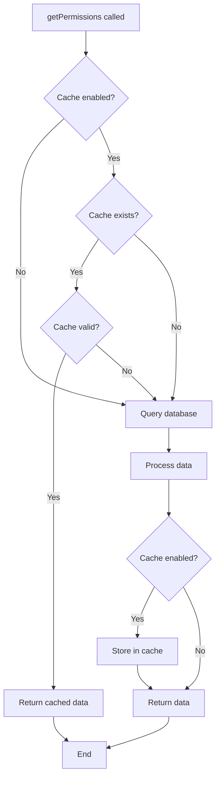

## Overview

GAC's caching system significantly improves performance by storing processed permissions and restrictions. This guide covers cache configuration, purging strategies, and optimization techniques.

## How Caching Works

### Cache Flow



### What Gets Cached

GAC caches three types of data per entity:

1. **Permissions** - Processed module access data
2. **Restrictions** - Entity-specific restrictions
3. **Global Restrictions** - System-wide restrictions

### Cache Keys

From `src/GAC.php:49`:

```php
public function getCacheKey(string $type): string {
    if ($type == 'restrictions_global') {
        return $this->cachekey . '_r_global';
    }
    else {
        $type = substr($type, 0, 1);
        return $this->cachekey . '_' . $type . '_' . $this->entityType . '_' . $this->entityId;
    }
}
```

**Key Format:**
- Permissions: `{prefix}_p_{entity_type}_{entity_id}`
- Restrictions: `{prefix}_r_{entity_type}_{entity_id}`
- Global restrictions: `{prefix}_r_global`

**Examples:**
```
gac_p_1_123      // User #123 permissions
gac_r_1_123      // User #123 restrictions
gac_p_2_456      // Client #456 permissions
gac_r_global     // Global restrictions
```

## Cache Configuration

### Basic Setup

```php
use DancasDev\GAC\GAC;

$gac = new GAC();
$gac->setDatabase($pdo);

// Default cache
$gac->setCache();
// Prefix: 'gac'
// TTL: 1800 seconds (30 minutes)
// Dir: vendor/dancasdev/gac/src/writable/
```

### Custom Configuration

```php
// Custom prefix, TTL, and directory
$gac->setCache(
    key: 'myapp_acl',           // Unique prefix
    ttl: 3600,                   // 1 hour
    dir: '/var/cache/gac'        // Custom directory
);
```

### Environment-based TTL

<Tabs>
  <Tab title="Development">
    ```php
    // Short TTL for rapid development
    $gac->setCache('dev_gac', 300); // 5 minutes
    ```
  </Tab>

  <Tab title="Staging">
    ```php
    // Medium TTL for testing
    $gac->setCache('staging_gac', 1800); // 30 minutes
    ```
  </Tab>

  <Tab title="Production">
    ```php
    // Long TTL for performance
    $gac->setCache('prod_gac', 7200); // 2 hours
    ```
  </Tab>
</Tabs>

### Dynamic TTL per Entity

```php
$gac = new GAC();
$gac->setDatabase($pdo);
$gac->setCache('myapp', 1800);

// Admin users: shorter cache (permissions change frequently)
$gac->setEntity('user', $adminId);
$gac->setCacheTtl(600); // 10 minutes
$permissions = $gac->getPermissions();

// Regular users: longer cache (permissions rarely change)
$gac->setEntity('user', $regularUserId);
$gac->setCacheTtl(3600); // 1 hour
$permissions = $gac->getPermissions();

// API clients: very long cache (permissions almost never change)
$gac->setEntity('client', $clientId);
$gac->setCacheTtl(86400); // 24 hours
$permissions = $gac->getPermissions();
```

## Bypassing Cache

### Force Database Query

```php
// Skip cache and query database directly
$permissions = $gac->getPermissions(fromCache: false);
$restrictions = $gac->getRestrictions(fromCache: false);

// Data is still saved to cache after querying
```

### Disable Cache Entirely

```php
$gac = new GAC();
$gac->setDatabase($pdo);
// Don't call setCache() - caching is disabled

$permissions = $gac->getPermissions(); // Always queries database
```

## Clearing Cache

### Clear Specific Entity Cache

```php
$gac = new GAC();
$gac->setDatabase($pdo);
$gac->setCache();
$gac->setEntity('user', 123);

// Clear cache for user #123
$gac->clearCache();

// Clear cache including global restrictions
$gac->clearCache(includeGlobal: true);
```

From `src/GAC.php:202`:

```php
public function clearCache(bool $includeGlobal = false): bool {
    if (empty($this->cacheAdapter)) {
        throw new CacheAdapterException('Cache adapter not set.', 1);
    }

    # Permisos
    $cacheKey = $this->getCacheKey('permissions');
    $this->cacheAdapter->delete($cacheKey);

    # Restricciones
    $cacheKey = $this->getCacheKey('restrictions');
    $this->cacheAdapter->delete($cacheKey);

    // globales
    if ($includeGlobal) {
        $cacheKey = $this->getCacheKey('restrictions_global');
        $this->cacheAdapter->delete($cacheKey);
    }

    return true;
}
```

### Purging Strategies

GAC provides targeted cache purging methods.

<AccordionGroup>
  <Accordion title="Purge by User IDs">
    Clear cache for specific users:

    ```php
    $gac = new GAC();
    $gac->setDatabase($pdo);
    $gac->setCache();

    // Purge cache for users #123, #456, #789
    $gac->purgePermissionsBy('user', [123, 456, 789]);
    $gac->purgeRestrictionsBy('user', [123, 456, 789]);
    ```

    **Use case:** When you update user permissions directly.
  </Accordion>

  <Accordion title="Purge by Client IDs">
    Clear cache for API clients:

    ```php
    // Purge cache for clients #10, #20
    $gac->purgePermissionsBy('client', [10, 20]);
    $gac->purgeRestrictionsBy('client', [10, 20]);
    ```

    **Use case:** When you revoke or modify API client access.
  </Accordion>

  <Accordion title="Purge by Role IDs">
    Clear cache for all users/clients with specific roles:

    ```php
    // Purge cache for all entities with roles #5, #12
    $gac->purgePermissionsBy('role', [5, 12]);
    $gac->purgeRestrictionsBy('role', [5, 12]);
    ```

    **How it works:** Queries `gac_role_entity` to find all users and clients with the specified roles, then purges their cache.

    From `src/GAC.php:279`:
    ```php
    elseif($entityType == 'role') {
        $result = $this->databaseAdapter->getEntitiesByRoles($entityIds);
        foreach ($result as $record) {
            $list[$record['entity_type']] ??= [];
            $list[$record['entity_type']][$record['entity_id']] = $record['entity_id'];
        }
    }
    ```

    **Use case:** When you modify role permissions.
  </Accordion>

  <Accordion title="Global Purge">
    Clear all cached permissions or restrictions:

    ```php
    // Purge ALL entity permissions
    $gac->purgePermissionsBy('global', []);

    // Purge ALL entity restrictions
    $gac->purgeRestrictionsBy('global', []);
    ```

    Uses pattern matching from `src/GAC.php:264`:
    ```php
    if ($entityType == 'global') {
        $this->cacheAdapter->deleteMatching($this->cachekey . '_' . $type . '_*');
    }
    ```

    **Use case:** Major permission restructuring or system maintenance.
  </Accordion>
</AccordionGroup>

## Cache Management Patterns

### When Permissions Change

```php
class PermissionManager {
    private GAC $gac;
    
    public function __construct(GAC $gac) {
        $this->gac = $gac;
    }
    
    public function assignPermissionToUser($userId, $moduleId, $features) {
        // Update database
        $stmt = $this->pdo->prepare(
            "INSERT INTO gac_module_access 
            (from_entity_type, from_entity_id, to_entity_type, to_entity_id, feature, created_at) 
            VALUES ('1', ?, '1', ?, ?, UNIX_TIMESTAMP())"
        );
        $stmt->execute([$userId, $moduleId, implode(',', $features)]);
        
        // Clear user cache
        $this->gac->purgePermissionsBy('user', [$userId]);
    }
    
    public function assignPermissionToRole($roleId, $moduleId, $features) {
        // Update database
        $stmt = $this->pdo->prepare(
            "INSERT INTO gac_module_access 
            (from_entity_type, from_entity_id, to_entity_type, to_entity_id, feature, created_at) 
            VALUES ('0', ?, '1', ?, ?, UNIX_TIMESTAMP())"
        );
        $stmt->execute([$roleId, $moduleId, implode(',', $features)]);
        
        // Clear cache for all users with this role
        $this->gac->purgePermissionsBy('role', [$roleId]);
    }
    
    public function assignRoleToUser($userId, $roleId, $priority = 0) {
        // Update database
        $stmt = $this->pdo->prepare(
            "INSERT INTO gac_role_entity 
            (role_id, entity_type, entity_id, priority, created_at) 
            VALUES (?, '1', ?, ?, UNIX_TIMESTAMP())"
        );
        $stmt->execute([$roleId, $userId, $priority]);
        
        // Clear user cache (they now inherit role permissions)
        $this->gac->purgePermissionsBy('user', [$userId]);
        $this->gac->purgeRestrictionsBy('user', [$userId]);
    }
}
```

### Batch Operations

```php
class BulkPermissionUpdate {
    private GAC $gac;
    private PDO $pdo;
    
    public function revokeFeatureFromAllUsers($moduleCode, $feature) {
        // Get module ID
        $stmt = $this->pdo->prepare("SELECT id FROM gac_module WHERE code = ?");
        $stmt->execute([$moduleCode]);
        $moduleId = $stmt->fetchColumn();
        
        // Update all permissions for this module
        $stmt = $this->pdo->prepare(
            "UPDATE gac_module_access 
            SET feature = REPLACE(feature, ?, ''),
                updated_at = UNIX_TIMESTAMP()
            WHERE to_entity_type = '1' AND to_entity_id = ?"
        );
        $stmt->execute([$feature, $moduleId]);
        
        // Clear all caches (permissions changed globally)
        $this->gac->purgePermissionsBy('global', []);
    }
}
```

### Scheduled Cache Refresh

```php
// Cron job: refresh-cache.php
require 'vendor/autoload.php';

use DancasDev\GAC\GAC;

$gac = new GAC();
$gac->setDatabase($dbConfig);
$gac->setCache('myapp', 3600, '/var/cache/gac');

// Get all active users
$stmt = $pdo->query(
    "SELECT id FROM gac_user 
    WHERE is_disabled = '0' AND deleted_at IS NULL"
);
$userIds = $stmt->fetchAll(PDO::FETCH_COLUMN);

echo "Refreshing cache for " . count($userIds) . " users...\n";

foreach ($userIds as $userId) {
    $gac->setEntity('user', $userId);
    $gac->clearCache();
    
    // Rebuild cache
    $gac->getPermissions(fromCache: false);
    $gac->getRestrictions(fromCache: false);
    
    echo "Refreshed cache for user #{$userId}\n";
}

echo "Cache refresh complete.\n";
```

## Performance Optimization

### Cache Hit Rate Monitoring

```php
class CacheMonitor {
    private static $hits = 0;
    private static $misses = 0;
    
    public static function recordHit() {
        self::$hits++;
    }
    
    public static function recordMiss() {
        self::$misses++;
    }
    
    public static function getStats() {
        $total = self::$hits + self::$misses;
        $hitRate = $total > 0 ? (self::$hits / $total) * 100 : 0;
        
        return [
            'hits' => self::$hits,
            'misses' => self::$misses,
            'total' => $total,
            'hit_rate' => round($hitRate, 2) . '%'
        ];
    }
}

// Wrapper around GAC
class MonitoredGAC extends GAC {
    public function getPermissions(bool $fromCache = true) {
        $cacheKey = $this->getCacheKey('permissions');
        
        if ($fromCache && $this->cacheAdapter->get($cacheKey) !== null) {
            CacheMonitor::recordHit();
        } else {
            CacheMonitor::recordMiss();
        }
        
        return parent::getPermissions($fromCache);
    }
}

// At end of request
register_shutdown_function(function() {
    $stats = CacheMonitor::getStats();
    error_log("GAC Cache Stats: " . json_encode($stats));
});
```

### Optimal TTL Selection

<Tip>
**General Guidelines:**

- **High-frequency changes** (admin permissions): 5-10 minutes
- **Medium-frequency changes** (regular users): 30-60 minutes
- **Low-frequency changes** (API clients, roles): 2-24 hours
- **Static configurations**: No expiration (manually purge on change)
</Tip>

```php
function getOptimalTtl($entityType, $entityId, $pdo) {
    if ($entityType === 'client') {
        // API clients rarely change
        return 86400; // 24 hours
    }
    
    // Check if user is admin
    $stmt = $pdo->prepare(
        "SELECT COUNT(*) FROM gac_role_entity re
        INNER JOIN gac_role r ON re.role_id = r.id
        WHERE re.entity_type = '1' AND re.entity_id = ? 
        AND r.code = 'system_administrator'"
    );
    $stmt->execute([$entityId]);
    $isAdmin = $stmt->fetchColumn() > 0;
    
    if ($isAdmin) {
        return 600; // 10 minutes for admins
    }
    
    return 3600; // 1 hour for regular users
}

// Usage
$ttl = getOptimalTtl('user', $userId, $pdo);
$gac->setCache('myapp', $ttl);
```

### Memory Usage Optimization

```php
// For large-scale applications with many users
class EfficientCacheManager {
    private GAC $gac;
    private array $loadedEntities = [];
    
    public function getPermissions($entityType, $entityId) {
        $cacheKey = "{$entityType}_{$entityId}";
        
        // Check if already loaded in memory (within same request)
        if (isset($this->loadedEntities[$cacheKey])) {
            return $this->loadedEntities[$cacheKey];
        }
        
        // Load from GAC (cache or DB)
        $this->gac->setEntity($entityType, $entityId);
        $permissions = $this->gac->getPermissions();
        
        // Store in memory for this request
        $this->loadedEntities[$cacheKey] = $permissions;
        
        return $permissions;
    }
    
    public function __destruct() {
        // Free memory at end of request
        $this->loadedEntities = [];
    }
}
```

## Cache Storage Options

### File-based Cache (Default)

```php
$gac->setCache('myapp', 3600, '/var/cache/gac');
```

**Pros:**
- Simple setup
- No external dependencies
- Persistent across server restarts

**Cons:**
- Slower than in-memory caches
- File I/O overhead
- Not ideal for high-concurrency

### Redis Cache (Custom Adapter)

```php
use DancasDev\GAC\Adapters\CacheAdapterInterface;

class RedisCacheAdapter implements CacheAdapterInterface {
    private $redis;
    
    public function __construct($config) {
        $this->redis = new Redis();
        $this->redis->connect($config['host'], $config['port']);
        if (isset($config['password'])) {
            $this->redis->auth($config['password']);
        }
        $this->redis->select($config['database'] ?? 0);
    }
    
    public function get(string $key): mixed {
        $data = $this->redis->get($key);
        return $data ? json_decode($data, true) : null;
    }
    
    public function save(string $key, mixed $data, ?int $ttl = 60): bool {
        $encoded = json_encode($data);
        return $ttl 
            ? $this->redis->setex($key, $ttl, $encoded)
            : $this->redis->set($key, $encoded);
    }
    
    public function delete(string $key): bool {
        return $this->redis->del($key) > 0;
    }
    
    public function deleteMatching(string $pattern): int {
        $keys = $this->redis->keys($pattern);
        return !empty($keys) ? $this->redis->del(...$keys) : 0;
    }
    
    public function clean(): bool {
        return $this->redis->flushDB();
    }
}

// Usage
$redisAdapter = new RedisCacheAdapter([
    'host' => '127.0.0.1',
    'port' => 6379,
    'database' => 0
]);

$gac->setCache('myapp', 3600, $redisAdapter);
```

**Pros:**
- Very fast (in-memory)
- High concurrency support
- Advanced features (TTL, patterns)

**Cons:**
- External dependency
- Data lost on restart (unless persistent)
- Requires more setup

### Memcached (Custom Adapter)

Similar to Redis - see [Custom Adapters](/guides/custom-adapters) guide.

## Debugging Cache Issues

### Verify Cache is Working

```php
$gac = new GAC();
$gac->setDatabase($pdo);
$gac->setCache('test', 3600);
$gac->setEntity('user', 1);

// First load (should query DB)
$start = microtime(true);
$permissions1 = $gac->getPermissions(fromCache: false);
$time1 = microtime(true) - $start;

// Second load (should use cache)
$start = microtime(true);
$permissions2 = $gac->getPermissions(fromCache: true);
$time2 = microtime(true) - $start;

echo "DB query time: " . round($time1 * 1000, 2) . "ms\n";
echo "Cache hit time: " . round($time2 * 1000, 2) . "ms\n";
echo "Speedup: " . round($time1 / $time2, 2) . "x\n";

// Verify data is identical
if ($permissions1->getList() === $permissions2->getList()) {
    echo "Cache data matches DB data ✓\n";
} else {
    echo "Cache data mismatch ✗\n";
}
```

### Check Cache Directory

```bash
# List cache files
ls -lah /var/cache/gac/

# Check cache file content
cat /var/cache/gac/myapp_p_1_123

# Monitor cache creation in real-time
watch -n 1 'ls -lah /var/cache/gac/ | tail -20'
```

### Cache File Structure

From `src/Adapters/CacheAdapter.php:66`:

```php
public function save(string $key, $data, int|null $ttl = 60): bool {
    $dataToSave = [
        't' => empty($ttl) ? null : time() + $ttl,
        'v' => $data
    ];
    
    return file_put_contents($file, json_encode($dataToSave)) !== false;
}
```

Example cache file content:
```json
{
  "t": 1735689600,
  "v": {
    "users": {"i": 1, "d": "0", "f": ["0","1","2","3"], "l": 1},
    "roles": {"i": 2, "d": "0", "f": ["1"], "l": 1}
  }
}
```

- `t`: Expiration timestamp (Unix time)
- `v`: Actual cached data

## Next Steps

<CardGroup cols={2}>
  <Card title="Custom Adapters" icon="code" href="/guides/custom-adapters">
    Create custom cache and database adapters
  </Card>
  <Card title="Setup Adapters" icon="plug" href="/guides/setup-adapters">
    Review adapter configuration options
  </Card>
</CardGroup>