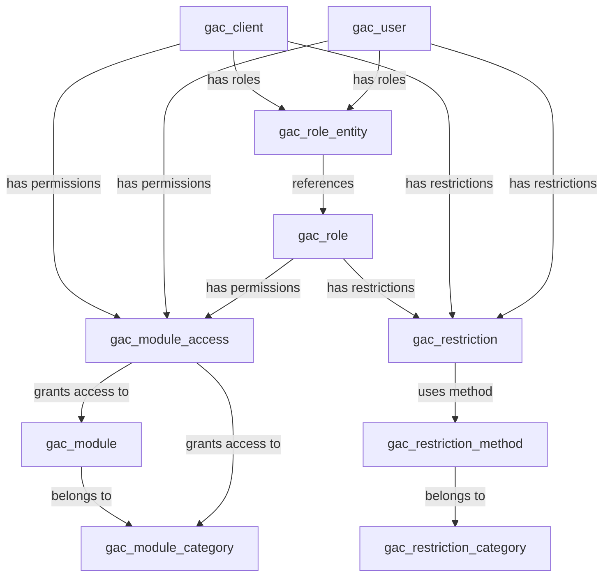

## Database Schema Overview

GAC uses a relational database schema with 9 core tables that work together to provide granular access control. The schema is designed for flexibility and can be customized to fit your application's needs.

### Core Tables

<AccordionGroup>
  <Accordion title="gac_user - User Accounts">
    Stores user authentication and session data.

    ```sql
    CREATE TABLE `gac_user` (
      `id` int NOT NULL AUTO_INCREMENT,
      `person_id` int NOT NULL,
      `username` varchar(60) NOT NULL,
      `password` varchar(255) NOT NULL,
      `failed_attempt_count` tinyint(1) NOT NULL DEFAULT '0',
      `failed_attempt_date` bigint DEFAULT NULL,
      `last_login` bigint DEFAULT NULL,
      `last_login_ip` varchar(39) DEFAULT NULL,
      `last_login_type` enum('0','1') DEFAULT NULL,
      `is_disabled` enum('0','1') NOT NULL DEFAULT '0',
      `created_at` bigint NOT NULL,
      `updated_at` bigint DEFAULT NULL,
      `deleted_at` bigint DEFAULT NULL,
      PRIMARY KEY (`id`),
      UNIQUE KEY `username` (`username`),
      KEY `person_id` (`person_id`),
      CONSTRAINT `gac_user_ibfk_1` FOREIGN KEY (`person_id`) REFERENCES `glb_person` (`id`)
    );
    ```

    **Key Fields:**
    - `person_id`: Links to person directory (customizable)
    - `failed_attempt_count`: Security feature for brute force protection
    - `last_login_type`: '0' = Manual, '1' = Google OAuth
  </Accordion>

  <Accordion title="gac_client - External Applications">
    Manages API clients and external system access.

    ```sql
    CREATE TABLE `gac_client` (
      `id` int NOT NULL AUTO_INCREMENT,
      `name` varchar(60) NOT NULL,
      `description` text,
      `client_id` varchar(255) NOT NULL,
      `client_secret` varchar(255) NOT NULL COMMENT 'Must be hashed',
      `failed_attempt_count` tinyint(1) NOT NULL DEFAULT '0',
      `failed_attempt_date` bigint DEFAULT NULL,
      `last_login` bigint DEFAULT NULL,
      `last_login_ip` varchar(39) DEFAULT NULL,
      `is_disabled` enum('0','1') NOT NULL DEFAULT '0',
      `created_at` bigint NOT NULL,
      `updated_at` bigint DEFAULT NULL,
      `deleted_at` bigint DEFAULT NULL,
      PRIMARY KEY (`id`),
      UNIQUE KEY `client_id` (`client_id`)
    );
    ```

    <Warning>
    Always hash `client_secret` before storage. Never store plain text secrets.
    </Warning>
  </Accordion>

  <Accordion title="gac_role - Permission Groups">
    Defines roles that can be assigned to users and clients.

    ```sql
    CREATE TABLE `gac_role` (
      `id` int NOT NULL AUTO_INCREMENT,
      `name` varchar(30) NOT NULL,
      `code` varchar(30) NOT NULL,
      `description` varchar(255) DEFAULT NULL,
      `is_disabled` enum('0','1') NOT NULL DEFAULT '0',
      `created_at` bigint NOT NULL,
      `updated_at` bigint DEFAULT NULL,
      `deleted_at` bigint DEFAULT NULL,
      PRIMARY KEY (`id`),
      UNIQUE KEY `code` (`code`)
    );
    ```

    Example roles:
    - `system_administrator`: Full system access
    - `system_supervisor`: Read-only system access
  </Accordion>

  <Accordion title="gac_role_entity - Role Assignments">
    Links roles to users or clients with priority levels.

    ```sql
    CREATE TABLE `gac_role_entity` (
      `id` int NOT NULL AUTO_INCREMENT,
      `role_id` int NOT NULL,
      `entity_type` enum('1','2') NOT NULL COMMENT '1=User, 2=Client',
      `entity_id` int NOT NULL,
      `priority` enum('0','1','2','3','4') NOT NULL DEFAULT '0',
      `is_disabled` enum('0','1') NOT NULL DEFAULT '0',
      `created_at` bigint NOT NULL,
      `updated_at` bigint DEFAULT NULL,
      `deleted_at` bigint DEFAULT NULL,
      PRIMARY KEY (`id`),
      UNIQUE KEY `role_unique` (`role_id`,`entity_type`,`entity_id`),
      UNIQUE KEY `priority_unique` (`entity_type`,`entity_id`,`priority`),
      CONSTRAINT `gac_role_entity_ibfk_1` FOREIGN KEY (`role_id`) REFERENCES `gac_role` (`id`)
    );
    ```

    **Priority System:**
    - `0`: Primary role (each entity can have only one)
    - `1-4`: Secondary roles (one per priority level)
  </Accordion>

  <Accordion title="gac_module_category - Module Groups">
    Organizes modules into logical categories.

    ```sql
    CREATE TABLE `gac_module_category` (
      `id` int NOT NULL AUTO_INCREMENT,
      `name` varchar(60) NOT NULL,
      `description` varchar(255) DEFAULT NULL,
      `is_disabled` enum('0','1') NOT NULL DEFAULT '0',
      `created_at` bigint NOT NULL,
      `updated_at` bigint DEFAULT NULL,
      `deleted_at` bigint DEFAULT NULL,
      PRIMARY KEY (`id`),
      UNIQUE KEY `name` (`name`)
    );
    ```

    Default categories:
    - **Sistema**: System administration modules
    - **Usuario**: User profile modules
    - **Directorios**: Directory management modules
  </Accordion>

  <Accordion title="gac_module - Application Modules">
    Defines individual modules/features in your application.

    ```sql
    CREATE TABLE `gac_module` (
      `id` int NOT NULL AUTO_INCREMENT,
      `module_category_id` int NOT NULL,
      `name` varchar(60) NOT NULL,
      `code` varchar(40) NOT NULL,
      `description` varchar(255) DEFAULT NULL,
      `base_route` varchar(255) NOT NULL,
      `is_developing` enum('0','1') NOT NULL DEFAULT '1',
      `is_disabled` enum('0','1') NOT NULL DEFAULT '0',
      `created_at` bigint NOT NULL,
      `updated_at` bigint DEFAULT NULL,
      `deleted_at` bigint DEFAULT NULL,
      PRIMARY KEY (`id`),
      UNIQUE KEY `code` (`code`),
      KEY `module_category_id` (`module_category_id`),
      CONSTRAINT `gac_module_ibfk_1` FOREIGN KEY (`module_category_id`) REFERENCES `gac_module_category` (`id`)
    );
    ```

    **Important Fields:**
    - `code`: Used in permission checks (e.g., `users`, `my_profile`)
    - `base_route`: URL path (supports parameters like `/users/{:user_id}/access`)
    - `is_developing`: When '1', only users with 'dev' feature can access
  </Accordion>

  <Accordion title="gac_module_access - Permission Grants">
    The core permission table that grants access to modules.

    ```sql
    CREATE TABLE `gac_module_access` (
      `id` int NOT NULL AUTO_INCREMENT,
      `from_entity_type` enum('0','1','2') NOT NULL COMMENT '0=Role, 1=User, 2=Client',
      `from_entity_id` int NOT NULL,
      `to_entity_type` enum('0','1') NOT NULL COMMENT '0=Category, 1=Module',
      `to_entity_id` int NOT NULL,
      `feature` set('0','1','2','3','4','5') NOT NULL,
      `level` enum('0','1','2') NOT NULL DEFAULT '1',
      `is_disabled` enum('0','1') NOT NULL DEFAULT '0',
      `created_at` bigint NOT NULL,
      `updated_at` bigint DEFAULT NULL,
      `deleted_at` bigint DEFAULT NULL,
      PRIMARY KEY (`id`),
      UNIQUE KEY `access_unique` (`from_entity_type`,`from_entity_id`,`to_entity_type`,`to_entity_id`)
    );
    ```

    **Feature Flags:**
    - `0`: Create
    - `1`: Read
    - `2`: Update
    - `3`: Delete
    - `4`: Trash (works with read, update, delete)
    - `5`: Development mode access

    **Access Levels:**
    - `0`: Low (restricted access)
    - `1`: Normal (standard access)
    - `2`: High (full access)
  </Accordion>

  <Accordion title="gac_restriction_category - Restriction Types">
    Defines types of restrictions (e.g., by branch, by date).

    ```sql
    CREATE TABLE `gac_restriction_category` (
      `id` int NOT NULL AUTO_INCREMENT,
      `name` varchar(60) NOT NULL,
      `code` varchar(30) NOT NULL,
      `description` varchar(255) DEFAULT NULL,
      `is_disabled` enum('0','1') NOT NULL DEFAULT '0',
      `created_at` bigint NOT NULL,
      `updated_at` bigint DEFAULT NULL,
      `deleted_at` bigint DEFAULT NULL,
      PRIMARY KEY (`id`),
      UNIQUE KEY `code` (`code`)
    );
    ```

    Default categories:
    - `by_branch`: Entity-based restrictions
    - `by_date`: Time-based restrictions
  </Accordion>

  <Accordion title="gac_restriction_method - Restriction Methods">
    Specific restriction methods within each category.

    ```sql
    CREATE TABLE `gac_restriction_method` (
      `id` int NOT NULL AUTO_INCREMENT,
      `restriction_category_id` int NOT NULL,
      `name` varchar(60) NOT NULL,
      `code` varchar(30) NOT NULL,
      `description` varchar(255) DEFAULT NULL,
      `is_disabled` enum('0','1') NOT NULL DEFAULT '0',
      `created_at` bigint NOT NULL,
      `updated_at` bigint DEFAULT NULL,
      `deleted_at` bigint DEFAULT NULL,
      PRIMARY KEY (`id`),
      UNIQUE KEY `code_unique` (`restriction_category_id`,`code`),
      CONSTRAINT `gac_restriction_method_ibfk_1` FOREIGN KEY (`restriction_category_id`) REFERENCES `gac_restriction_category` (`id`)
    );
    ```

    **Branch Methods:**
    - `deny`: All except specified entities
    - `allow`: Only specified entities

    **Date Methods:**
    - `in_range`: Within date range
    - `out_range`: Outside date range
    - `before`: Before specific date
    - `after`: After specific date
  </Accordion>

  <Accordion title="gac_restriction - Applied Restrictions">
    Actual restrictions applied to entities.

    ```sql
    CREATE TABLE `gac_restriction` (
      `id` int NOT NULL AUTO_INCREMENT,
      `entity_type` enum('0','1','2','3') NOT NULL COMMENT '0=Role, 1=User, 2=Client, 3=All',
      `entity_id` int NOT NULL,
      `restriction_method_id` int NOT NULL,
      `data` text NOT NULL COMMENT 'JSON validation data',
      `is_disabled` enum('0','1') NOT NULL DEFAULT '0',
      `created_at` bigint NOT NULL,
      `updated_at` bigint DEFAULT NULL,
      `deleted_at` bigint DEFAULT NULL,
      PRIMARY KEY (`id`),
      UNIQUE KEY `restriction_unique` (`entity_type`,`entity_id`,`restriction_method_id`),
      CONSTRAINT `gac_restriction_ibfk_1` FOREIGN KEY (`restriction_method_id`) REFERENCES `gac_restriction_method` (`id`)
    );
    ```

    The `data` field stores JSON configuration specific to each restriction type.
  </Accordion>
</AccordionGroup>

## Table Relationships



## Installing the Schema

<Steps>
  <Step title="Import the SQL file">
    The complete schema is provided in `tables.sql`. Import it into your MySQL database:

    ```bash
    mysql -u username -p database_name < tables.sql
    ```
  </Step>

  <Step title="Verify table creation">
    Check that all 10 tables were created successfully:

    ```sql
    SHOW TABLES LIKE 'gac_%';
    SHOW TABLES LIKE 'glb_%';
    ```

    You should see:
    - `gac_client`
    - `gac_module`
    - `gac_module_access`
    - `gac_module_category`
    - `gac_restriction`
    - `gac_restriction_category`
    - `gac_restriction_method`
    - `gac_role`
    - `gac_role_entity`
    - `gac_user`
    - `glb_person`
  </Step>

  <Step title="Review sample data">
    The SQL file includes sample data for:
    - 3 module categories (System, User, Directories)
    - 14 modules (users, roles, my_profile, etc.)
    - 2 roles (system_administrator, system_supervisor)
    - 2 restriction categories with 6 methods
    - 3 module access grants for the administrator role
  </Step>
</Steps>

## Customizing the Schema

### Adapting the Person Table

The `glb_person` table is designed to be customized for your application:

```sql
CREATE TABLE `glb_person` (
  `id` int NOT NULL AUTO_INCREMENT,
  `first_name` varchar(50) NOT NULL,
  `last_name` varchar(50) NOT NULL,
  `email` varchar(120) NOT NULL,
  `email_verified_date` bigint DEFAULT NULL,
  `google_id` varchar(45) DEFAULT NULL,
  `google_link_date` bigint DEFAULT NULL,
  `sex` enum('0','1') DEFAULT NULL COMMENT '0=Male, 1=Female',
  `is_disabled` enum('0','1') NOT NULL DEFAULT '0',
  `created_at` bigint NOT NULL,
  `updated_at` bigint DEFAULT NULL,
  `deleted_at` bigint DEFAULT NULL,
  PRIMARY KEY (`id`),
  UNIQUE KEY `email` (`email`),
  UNIQUE KEY `google_id` (`google_id`)
);
```

<Tip>
You can rename this table or add custom fields (phone, address, etc.) without affecting GAC functionality. Just maintain the foreign key relationship in `gac_user.person_id`.
</Tip>

### Adding Custom Fields

You can extend any GAC table with custom fields:

```sql
-- Add custom fields to gac_user
ALTER TABLE gac_user 
  ADD COLUMN department_id INT DEFAULT NULL,
  ADD COLUMN employee_code VARCHAR(20) DEFAULT NULL;

-- Add custom fields to gac_module
ALTER TABLE gac_module 
  ADD COLUMN icon VARCHAR(50) DEFAULT NULL,
  ADD COLUMN sort_order INT DEFAULT 0;

-- Add custom fields to gac_role
ALTER TABLE gac_role 
  ADD COLUMN color VARCHAR(7) DEFAULT NULL,
  ADD COLUMN is_system_role ENUM('0','1') DEFAULT '0';
```

### Using Different Table Prefixes

If you want to use different prefixes, update the table names and foreign key constraints:

```sql
-- Example: Changing from 'gac_' to 'acl_'
RENAME TABLE gac_user TO acl_user;
RENAME TABLE gac_role TO acl_role;
-- ... rename all tables

-- Update foreign key references
ALTER TABLE acl_role_entity 
  DROP FOREIGN KEY gac_role_entity_ibfk_1;
  
ALTER TABLE acl_role_entity 
  ADD CONSTRAINT acl_role_entity_ibfk_1 
  FOREIGN KEY (role_id) REFERENCES acl_role(id);
```

<Warning>
If you change table names, you'll need to modify the `DatabaseAdapter` class to use your custom table names. See [Custom Adapters](/guides/custom-adapters) for details.
</Warning>

## Soft Deletes

All GAC tables support soft deletes via the `deleted_at` field:

```sql
-- Soft delete a user
UPDATE gac_user 
SET deleted_at = UNIX_TIMESTAMP() 
WHERE id = 1;

-- Soft deleted records are automatically excluded from queries
SELECT * FROM gac_user WHERE deleted_at IS NULL;

-- Restore a soft deleted record
UPDATE gac_user 
SET deleted_at = NULL 
WHERE id = 1;
```

## Timestamp Format

GAC uses Unix timestamps (bigint) for all date/time fields:

```sql
-- Current timestamp
INSERT INTO gac_user (..., created_at) VALUES (..., UNIX_TIMESTAMP());

-- Converting to readable format
SELECT 
  username,
  FROM_UNIXTIME(created_at) as created_date,
  FROM_UNIXTIME(last_login) as last_login_date
FROM gac_user;
```

## Performance Optimization

### Recommended Indexes

The schema includes essential indexes. For large datasets, consider adding:

```sql
-- Index for frequent permission lookups
CREATE INDEX idx_access_lookup 
ON gac_module_access(from_entity_type, from_entity_id, is_disabled, deleted_at);

-- Index for restriction queries
CREATE INDEX idx_restriction_lookup 
ON gac_restriction(entity_type, entity_id, is_disabled, deleted_at);

-- Index for role queries
CREATE INDEX idx_role_entity_lookup 
ON gac_role_entity(entity_type, entity_id, is_disabled, deleted_at);
```

### Query Optimization

```sql
-- Use covering indexes for frequently accessed columns
CREATE INDEX idx_module_access_features 
ON gac_module_access(to_entity_id, feature, level) 
WHERE deleted_at IS NULL AND is_disabled = '0';

-- Partition large tables by year (if you have millions of records)
ALTER TABLE gac_user 
PARTITION BY RANGE (created_at) (
  PARTITION p2024 VALUES LESS THAN (UNIX_TIMESTAMP('2025-01-01')),
  PARTITION p2025 VALUES LESS THAN (UNIX_TIMESTAMP('2026-01-01')),
  PARTITION p_future VALUES LESS THAN MAXVALUE
);
```

## Next Steps

<CardGroup cols={2}>
  <Card title="Setup Adapters" icon="plug" href="/guides/setup-adapters">
    Configure database and cache adapters
  </Card>
  <Card title="Checking Permissions" icon="shield-check" href="/guides/checking-permissions">
    Learn how to check permissions in your code
  </Card>
</CardGroup>